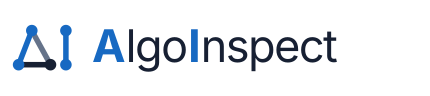
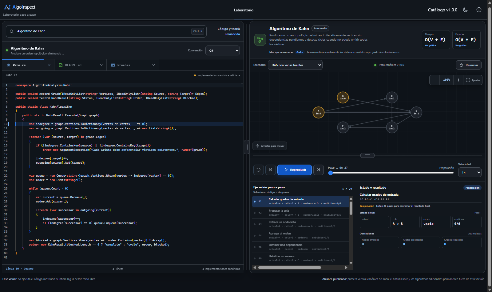
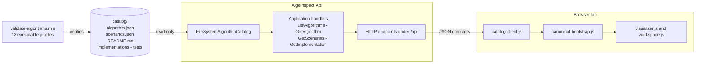

<div align="center">

<picture>
  <source media="(prefers-color-scheme: dark)" srcset="src/frontend/public/assets/brand/algo-inspect-logo.svg">
  <source media="(prefers-color-scheme: light)" srcset="src/frontend/public/assets/brand/algo-inspect-logo-light.svg">
  
</picture>

### A canonical algorithm catalog you can step through, verified in four languages

[](https://github.com/aihernandez/AlgoInspect/actions/workflows/ci.yml)
[](LICENSE)
[](https://dotnet.microsoft.com)
[](https://nodejs.org)
[](CONTRIBUTING.md)

<p><em>Read the algorithm. Run the scenario. Watch every step.</em></p>

</div>



---

## Table of contents

- [Why this exists](#why-this-exists)
- [See it in action](#see-it-in-action)
- [Features](#features)
- [What works today](#what-works-today)
- [Quick start](#quick-start)
- [Architecture](#architecture)
- [Anatomy of a catalog entry](#anatomy-of-a-catalog-entry)
- [Verifying a change](#verifying-a-change)
- [Roadmap](#roadmap)
- [FAQ](#faq)
- [Documentation](#documentation)
- [Contributing](#contributing)
- [Support](#support)
- [License](#license)

## Why this exists

Most algorithm explanations come in one of two shapes. Either you get a page of prose with
a Big O label at the bottom, or you get working code with no explanation attached. In
neither case can you check the explanation against the code.

AlgoInspect puts both in the same place:

- **One canonical source.** An algorithm's documentation, implementations, scenarios and
  tests all live in one versioned entry, instead of being spread across a wiki and a repo.
- **Verified across languages.** The same scenarios run against every implementation. If
  the C# version and the Python version disagree, the build fails.
- **Step by step, not just a result.** The lab runs an algorithm over a scenario and shows
  you the execution as it happens, with the state after each step.
- **Local by default.** Nothing leaves your machine unless you explicitly turn telemetry
  on, and it ships turned off. The browser doesn't load anything from a CDN either. D3,
  Cytoscape, Mermaid and Monaco are all bundled at build time.

It's meant for students and teachers who need to see the steps, and for developers who want
a reference implementation they can trust, because they can watch it pass its own tests.

## See it in action

Kahn's algorithm running on a directed acyclic graph with several sources, then the same
algorithm finding a cycle. Along the way the recording switches source language and content
tab.


> [Download the full-resolution recording](docs/assets/kahn-walkthrough.mp4) (901 KB, 39 s).
> A hosted demo at `algoinspect.com` is on the [roadmap](#roadmap), but it isn't deployed yet.

## Features

| | |
| --- | --- |
| **Step-by-step traces** | Every run is broken into discrete steps, with the state before and after each one. |
| **Four languages, one behavior** | C#, Python, JavaScript and TypeScript implementations, all verified against the same scenarios. |
| **Canonical scenarios** | 33 curated cases covering boundaries, cycles, duplicates and malformed input, not just the happy path. |
| **Live graph visualization** | Cytoscape-rendered graphs that update as the algorithm advances, with zoom and fit controls. |
| **Rearrangeable workspace** | Drag panels around to organize the lab however suits what you're studying. |
| **Source, README and tests together** | Read the implementation, the theory and the test suite without leaving the algorithm. |
| **Accessible by intent** | Keyboard navigation, ARIA roles and visible focus are acceptance criteria, not afterthoughts. |
| **Hardened for the internet** | Rate limiting, security headers, restrictive `AllowedHosts`, health checks and dependency auditing in CI. |

## What works today

The repository holds two solutions that are kept separate on purpose:

| Solution | Role |
| --- | --- |
| **Algorithm Catalog** | The canonical source of truth: algorithms, implementations, scenarios, tests and documentation. |
| **AlgoInspect Web** | The API and visual lab that read the catalog to render code, traces and documentation. |

The catalog ships three algorithms (Kahn's topological sort, binary search and bubble sort)
with 33 scenarios and 12 executable profiles, meaning each algorithm in C#, Python,
JavaScript and TypeScript. All three run end to end, from catalog to lab. The schema also
reserves Java, Rust, Ruby, C, C++ and Node.js for later.

> **About complexity.** What the catalog shows today is curated metadata, not computed
> analysis. Each entry declares its time complexity as reviewed content, the same way it
> declares its prose. The analysis engine described further down is designed but not built.

## Quick start

### Prerequisites

| Tool | Version | Needed for |
| --- | --- | --- |
| [.NET SDK](https://dotnet.microsoft.com/download) | `10.0.302` | API, catalog validation, C# implementations and tests |
| [Node.js](https://nodejs.org) | `24` | Web build, bundled assets, end-to-end tests |
| [Python](https://www.python.org/downloads/) | `3.13` + `pytest` | Python implementations and tests |

### Run it

```bash
git clone https://github.com/aihernandez/AlgoInspect.git
cd AlgoInspect

npm install
npm run build:web        # Tailwind, brand icons and bundled libraries
npm run dev              # starts the API and the lab
```

Open **<http://127.0.0.1:4398>** and pick an algorithm.

The lab keeps its state in the URL, so you can link straight to a specific run:

```
http://127.0.0.1:4398/?algorithm=kahn&language=python&scenario=cycle
```

## Architecture

The catalog doesn't know the web application exists. Everything flows one way.



Two .NET solutions build this repository. `AlgorithmCatalog.sln` builds the canonical
source, and `AlgoInspect.Web.sln` builds the API and the lab. A solution is a build view
rather than a copy of the projects, so a project can belong to both.

## Anatomy of a catalog entry

Every algorithm has the same shape, which is what makes the verification matrix possible:

```
catalog/algorithms/kahn/
├── algorithm.json                 # identity, complexity, implementation descriptors
├── README.md                      # theory, solution, history, references
├── scenarios.json                 # 11 verifiable cases, bilingual descriptions
├── implementations/
│   ├── csharp/Kahn.cs
│   ├── javascript/kahn.js
│   ├── python/kahn.py
│   └── typescript/kahn.ts
└── tests/
    ├── csharp/KahnTests.cs
    ├── javascript/kahn.test.js
    ├── python/test_kahn.py
    └── typescript/kahn.test.ts
```

## Verifying a change

```bash
npm run validate:catalog        # catalog schema and content integrity
npm run validate:algorithms     # every implementation against every scenario
npm run validate:kahn:failure   # proves the verification can actually fail
npm test                        # .NET tests plus Playwright end-to-end tests
```

Everything runs on Linux, macOS and Windows. CI runs the same checks on both
`ubuntu-latest` and `windows-latest`, plus CodeQL analysis and a container smoke test, on
every push and pull request.

`validate:kahn:failure` is worth explaining. It introduces a deliberate error into the
catalog and requires the matrix to find it. If a check has never failed, you don't actually
know it works.

## Roadmap

| Stage | What | Status |
| --- | --- | --- |
| Canonical catalog | Three algorithms, four languages, 33 scenarios | Done |
| Visual lab | Step-by-step traces, graph rendering, rearrangeable panels | Done |
| Hardening and CI | Rate limiting, security headers, cross-platform CI, CodeQL | Done |
| Bilingual interface | Full English and Spanish across the UI and catalog content | In progress |
| Hosted demo | Public deployment at `algoinspect.com` | Planned |
| Analysis engine | Time, space and cyclomatic complexity computed from code, each traceable to its evidence | Designed, not built |
| More algorithms and languages | Java, Rust, Ruby, C and C++ are reserved in the schema | Planned |
| CLI and editor extensions | The same analysis outside the browser | Later phase |

## FAQ

<details>
<summary><strong>Does AlgoInspect compute Big O from my code?</strong></summary>

Not yet. Right now the complexity shown for each algorithm is curated metadata reviewed by
a person, exactly like its prose documentation. The analysis engine is designed, and you
can read the design in [`ANALYSIS_MODEL.md`](docs/architecture/ANALYSIS_MODEL.md) and
[`analysis-result.schema.json`](contracts/schemas/analysis-result.schema.json), but it
isn't implemented. This README will keep saying so until it is.

</details>

<details>
<summary><strong>Why four languages for the same algorithm?</strong></summary>

Because agreement between them is evidence. If the C# and the Python implementation both
pass the same scenarios, the documented behavior is much more likely to be the real
behavior. When they disagree the build fails, so the catalog can't claim something it
hasn't proven.

</details>

<details>
<summary><strong>Can I add an algorithm?</strong></summary>

Yes, and it's the most useful contribution you can make. Follow the structure of an
existing entry, register the slug in `catalog/catalog.json`, and add tests for every
language you implement. You don't have to implement all four. See
[CONTRIBUTING.md](CONTRIBUTING.md).

</details>

<details>
<summary><strong>Why two .NET solutions in one repository?</strong></summary>

The catalog and the web application have different responsibilities and different release
rhythms, but splitting them into separate repositories now would make contract changes
painful. So: one workspace, two build views. If their release cycles ever diverge for
real, the split can be revisited.

</details>

<details>
<summary><strong>Does anything get sent to a server or an AI model?</strong></summary>

Not by default. The catalog is read from disk, the analysis is deterministic by design,
and the browser loads no third-party scripts, since every library is bundled at build time.

There is one opt-in exception. `Telemetry:Enabled` turns on server-side error reporting to
[Sentry](https://sentry.io), and it ships as `false`. If you clone this repository and run
it, nothing is sent anywhere. When it is enabled it reports server errors and traces only:
no personal data (`SendDefaultPii` is off) and nothing from the browser, which is why the
content security policy still restricts `connect-src` to the application itself.

</details>

## Documentation

| Document | What it covers |
| --- | --- |
| [`OVERVIEW.md`](docs/architecture/OVERVIEW.md) | Combined architecture and vertical slices |
| [`CONTENT_MODEL.md`](docs/architecture/CONTENT_MODEL.md) | How catalog content is modelled |
| [`API_CONTRACT.md`](docs/architecture/API_CONTRACT.md) | Contract between catalog and web |
| [`ANALYSIS_MODEL.md`](docs/architecture/ANALYSIS_MODEL.md) | Planned analysis results, metrics and evidence |
| [`TECHNOLOGY_STACK.md`](docs/architecture/TECHNOLOGY_STACK.md) | Build technologies and catalog languages |
| [`TESTING.md`](docs/architecture/TESTING.md) | How the catalog and the application are verified |

## Contributing

Contributions are welcome. Start with [`CONTRIBUTING.md`](CONTRIBUTING.md). The short
version: open an issue first so we can agree on scope, then make sure
`npm run validate:algorithms` and `npm test` pass.

Good places to start:

- add an algorithm, following the structure of an existing one;
- implement an existing algorithm in a language the catalog reserves but doesn't cover yet;
- improve scenarios, traces or the accessibility of the lab.

The [Code of Conduct](CODE_OF_CONDUCT.md) applies everywhere in this project.

## Support

- **Questions and ideas:** open a [discussion](https://github.com/aihernandez/AlgoInspect/discussions).
- **Bugs and feature requests:** open an [issue](https://github.com/aihernandez/AlgoInspect/issues/new/choose).
- **Security vulnerabilities:** please don't open a public issue. Follow [`SECURITY.md`](SECURITY.md).

## Acknowledgments

The catalog builds on published work, including A. B. Kahn's 1962 paper on topological
sorting and *Introduction to Algorithms*. Every algorithm entry cites its sources in its
own README.

Built with [D3](https://d3js.org), [Cytoscape.js](https://js.cytoscape.org),
[Mermaid](https://mermaid.js.org), [Monaco Editor](https://microsoft.github.io/monaco-editor/),
[Tailwind CSS](https://tailwindcss.com), [ASP.NET Core](https://dotnet.microsoft.com/apps/aspnet)
and [Playwright](https://playwright.dev).

## License

Released under the [MIT License](LICENSE).
