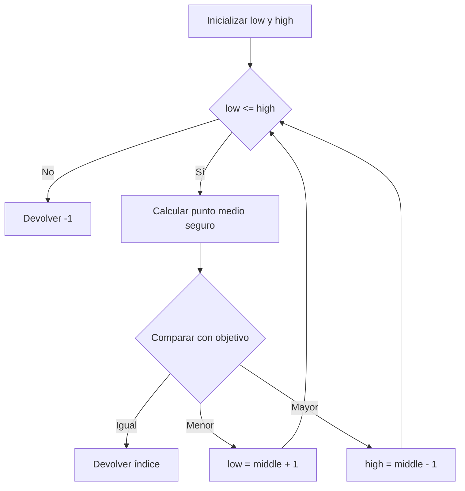

# Búsqueda binaria

## Descripción

La búsqueda binaria localiza un valor en un arreglo ordenado. Compara el objetivo con el elemento central y descarta la mitad que no puede contenerlo hasta encontrar una coincidencia o vaciar el intervalo.

## Ficha rápida

| Tipo | Familia | Paradigma | Conceptos |
|---|---|---|---|
| Arreglo ordenado | Búsqueda | Divide y vencerás | Intervalo, punto medio, invariante, límites |

| Rendimiento | Mejor | Promedio | Peor |
|---|---:|---:|---:|
| Tiempo | `O(1)` | `O(log n)` | `O(log n)` |
| Espacio auxiliar | `O(1)` | `O(1)` | `O(1)` |

## Problema

Dado un arreglo ascendente y un valor objetivo, devolver el índice base cero de una coincidencia o `-1` cuando no existe.

## Contexto

Es útil cuando los datos ya están ordenados y permiten acceso directo por índice. La variante canónica es iterativa; no comprueba el orden para no convertir una búsqueda `O(log n)` en una operación `O(n)`.

## Entradas

| Entrada | Tipo | Restricciones |
|---|---|---|
| Valores | Arreglo de enteros | Orden ascendente |
| Objetivo | Entero | Se compara con igualdad y orden total |
| Límites | Índices `low` y `high` | Intervalo cerrado y válido mientras `low <= high` |

## Salidas

| Salida | Significado |
|---|---|
| Índice `>= 0` | Posición de una coincidencia |
| `-1` | El objetivo está ausente |
| Duplicados | Primera coincidencia hallada por los puntos medios; no necesariamente la primera posición |

## Supuestos

### Explícitos

- El arreglo está ordenado de forma ascendente.
- La variante usa índices base cero.
- La igualdad y el orden de enteros son consistentes.

### Implícitos

- La precondición de orden no se valida durante la búsqueda.
- Con duplicados cualquier coincidencia es válida; la salida concreta es determinista por la fórmula del punto medio.
- El arreglo cabe en memoria y admite acceso `O(1)` por índice.

## Idea principal

> Conservar únicamente la mitad ordenada en la que todavía puede existir el objetivo.

## Visualización



El visualizador marca el intervalo activo, el punto medio y la mitad descartada en cada snapshot.

## Solución

1. Iniciar `low = 0` y `high = n - 1`.
2. Mientras el intervalo no esté vacío, calcular `middle = low + floor((high - low) / 2)`.
3. Si el valor central coincide, devolver su índice.
4. Si es menor que el objetivo, mover `low` a `middle + 1`.
5. En caso contrario, mover `high` a `middle - 1`.
6. Si el intervalo se vacía, devolver `-1`.

### Pseudocódigo

```text
procedure BinarySearch(values, target):
    low = 0
    high = length(values) - 1
    while low <= high:
        middle = low + floor((high - low) / 2)
        if values[middle] == target: return middle
        if values[middle] < target: low = middle + 1
        else: high = middle - 1
    return -1
```

## Correctitud

- Antes de cada iteración, si el objetivo existe, permanece dentro de `[low, high]`.
- Si el centro es menor, el orden ascendente prueba que ningún índice hasta `middle` puede contener el objetivo.
- El caso mayor descarta simétricamente desde `middle` hasta `high`.
- Cada actualización reduce estrictamente el intervalo, así que el ciclo termina.
- Una coincidencia es correcta por comparación directa; un intervalo vacío prueba ausencia bajo la precondición de orden.

## Complejidad detallada

Cada comparación reduce el intervalo a lo sumo a la mitad. Hay `O(log n)` iteraciones en promedio y en el peor caso, y `O(1)` si el primer punto medio coincide. La variante iterativa usa una cantidad constante de variables: `O(1)` espacio auxiliar.

La fórmula `low + (high - low) / 2` evita el overflow que podría producir `low + high` en enteros de tamaño fijo.

## Consecuencias

### Ventajas

- Reduce el espacio de búsqueda de forma logarítmica.
- Usa espacio auxiliar constante.
- La traza explica con precisión qué mitad se descarta.

### Desventajas

- Exige datos ordenados y acceso directo por índice.
- Ordenar solo para una consulta puede costar más que buscar linealmente.
- No define por sí sola el primer o último índice duplicado.

### Trade-offs

- No validar el orden conserva `O(log n)`, pero hace que la persona llamadora sea responsable de la precondición.
- Devolver cualquier coincidencia simplifica la variante; buscar un límite requiere continuar a izquierda o derecha.

## Alternativas

| Alternativa | Complejidad | Cuándo usarla |
|---|---:|---|
| Búsqueda lineal | `O(n)` | Datos pequeños o no ordenados |
| Lower bound | `O(log n)` | Se necesita el primer duplicado o punto de inserción |
| Tabla hash | `O(1)` promedio | Muchas consultas exactas sin recorrido ordenado |

## Pruebas

- Vacío y único elemento, tanto presente como ausente.
- Coincidencias al inicio, centro y final.
- Ausencia dentro y fuera del rango.
- Duplicados, negativos e intervalos pares.

El conjunto completo de parámetros y resultados se encuentra en el tab **Pruebas** y proviene de `scenarios.json`.

## Aplicaciones reales

- Consultas en tablas ordenadas y archivos indexados.
- Localización de versiones o marcas de tiempo.
- Cálculo de límites e inserción ordenada.
- Búsqueda sobre espacios de respuesta monotónicos.

## Errores comunes

| Error | Tratamiento en el visualizador |
|---|---|
| Buscar sobre datos no ordenados | Se declara como precondición, no como validación runtime |
| Usar `low < high` y omitir el último candidato | Los casos de uno y dos elementos lo detectan |
| No avanzar más allá del centro | La traza muestra límites estrictamente decrecientes |
| Calcular `(low + high) / 2` | Las cuatro fuentes usan la fórmula segura |
| Suponer el primer duplicado | El contrato declara coincidencia no extrema |

## Fuentes

- Paul E. Black, [“binary search”](https://www.nist.gov/dads/HTML/binarySearch.html), *NIST Dictionary of Algorithms and Data Structures*, 2022.
- Cormen, Leiserson, Rivest y Stein, [*Introduction to Algorithms*, 4th edition](https://mitpress.mit.edu/9780262046305/introduction-to-algorithms/), MIT Press, 2022.
