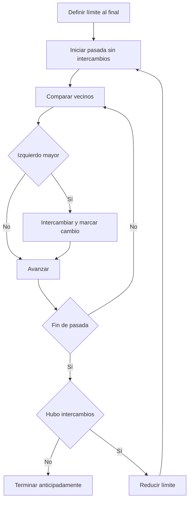

# Ordenamiento burbuja

## Descripción

Bubble Sort recorre pares adyacentes e intercambia los que están invertidos. Cada pasada coloca el mayor valor pendiente al final del intervalo activo. La variante canónica reduce ese límite y termina cuando una pasada no produce intercambios.

## Ficha rápida

| Tipo | Familia | Paradigma | Conceptos |
|---|---|---|---|
| Arreglo mutable | Ordenamiento por comparación | Intercambio adyacente | Pasada, inversión, estabilidad, salida temprana |

| Rendimiento | Mejor | Promedio | Peor |
|---|---:|---:|---:|
| Tiempo | `O(n)` | `O(n²)` | `O(n²)` |
| Espacio auxiliar | `O(1)` | `O(1)` | `O(1)` |

## Problema

Ordenar una colección mutable en forma ascendente mediante comparaciones e intercambios adyacentes, conservando el orden relativo de valores iguales.

## Contexto

Es una referencia educativa clara para observar ciclos anidados, inversiones y diferencias entre casos. No es una recomendación general para colecciones grandes.

## Entradas

| Entrada | Tipo | Restricciones |
|---|---|---|
| Valores | Lista mutable de enteros | Orden total y tamaño finito |
| Límite activo | Índice `end` | Disminuye una posición por pasada |
| Bandera | Booleano `swapped` | Se reinicia al comenzar cada pasada |

## Salidas

| Salida | Significado |
|---|---|
| Lista ordenada | La misma entrada, mutada in-place |
| Comparaciones | Pares adyacentes inspeccionados |
| Intercambios | Inversiones corregidas |
| Pasadas | Recorridos del intervalo activo |
| Terminación anticipada | Una pasada terminó sin intercambios |

## Supuestos

### Explícitos

- La colección es mutable y cabe en memoria.
- La comparación define un orden total ascendente.
- Solo se intercambia cuando `left > right`.

### Implícitos

- Los valores iguales no se intercambian, por lo que se conserva estabilidad.
- El sufijo fuera del límite activo ya está en posición final.
- Vacío y único elemento requieren cero pasadas.

## Idea principal

> Corregir inversiones adyacentes hasta que una pasada confirme que ya no queda ninguna.

## Visualización



El visualizador marca el par comparado, cada intercambio y el sufijo ya fijado.

## Solución

1. Colocar el límite activo en el último índice.
2. Iniciar una pasada con `swapped = false`.
3. Comparar cada par adyacente antes del límite.
4. Intercambiar cuando el izquierdo sea estrictamente mayor.
5. Al terminar, detenerse si no hubo intercambios.
6. Si hubo cambios, reducir el límite y repetir.

### Pseudocódigo

```text
procedure BubbleSort(values):
    for end from length(values) - 1 down to 1:
        swapped = false
        for index from 0 to end - 1:
            if values[index] > values[index + 1]:
                swap values[index], values[index + 1]
                swapped = true
        if not swapped: break
    return values
```

## Correctitud

- Un intercambio elimina una inversión adyacente sin desordenar valores iguales.
- Al terminar una pasada, el máximo del intervalo activo quedó en `end`.
- Por inducción, el sufijo posterior al límite permanece ordenado y definitivo.
- Si no hubo intercambios, no existe ninguna inversión adyacente; por transitividad, toda la lista está ordenada.
- El límite disminuye en cada pasada que continúa, de modo que el algoritmo termina.

## Complejidad detallada

Una entrada ordenada completa una sola pasada de `n - 1` comparaciones: `O(n)`. En promedio y en orden inverso se realizan pasadas anidadas cuya suma es `n(n - 1)/2`: `O(n²)`. Los intercambios se hacen sobre la entrada con variables constantes, por lo que el espacio auxiliar es `O(1)`.

Las métricas publicadas cuentan comparaciones, intercambios y pasadas del algoritmo, no los snapshots adicionales usados por la interfaz.

## Consecuencias

### Ventajas

- Implementación pequeña y fácil de inspeccionar.
- Es estable e in-place.
- La salida temprana hace visible el mejor caso lineal.

### Desventajas

- Tiempo cuadrático en entradas generales.
- Realiza muchos movimientos en orden inverso.
- Es poco apropiado para colecciones grandes.

### Trade-offs

- La bandera agrega una condición por pasada, pero evita trabajo cuadrático cuando la entrada ya está ordenada.
- Reducir el límite evita comparar el sufijo definitivo, aunque no cambia la cota cuadrática.

## Alternativas

| Alternativa | Complejidad | Cuándo usarla |
|---|---:|---|
| Insertion Sort | `O(n²)`; `O(n)` casi ordenado | Colecciones pequeñas y casi ordenadas |
| Merge Sort | `O(n log n)` | Se necesita estabilidad con escala |
| Heapsort | `O(n log n)` | Se prioriza espacio auxiliar constante |

## Pruebas

- Vacío, único elemento y entrada ya ordenada.
- Orden inverso y mezcla representativa.
- Duplicados, todos iguales y valores negativos.
- Dos elementos invertidos y cruce por cero.
- Métricas exactas para mejor caso, peor caso y salida anticipada.

El tab **Pruebas** muestra la matriz completa compartida por los cuatro lenguajes.

## Aplicaciones reales

- Enseñanza de invariantes, inversiones y complejidad cuadrática.
- Validación de trazas y contadores en visualizadores.
- Colecciones diminutas donde prima la simplicidad didáctica.

## Errores comunes

| Error | Tratamiento en el visualizador |
|---|---|
| Intercambiar también valores iguales | Las fuentes usan comparación estricta para conservar estabilidad |
| No reiniciar la bandera | Cada snapshot de inicio de pasada la reinicia |
| Ignorar la salida temprana | El escenario `sorted` exige una sola pasada |
| Recorrer siempre todo el arreglo | El sufijo definitivo se marca fuera del límite |
| Confundir in-place con memoria de la traza | Se separa el algoritmo de los snapshots educativos |

## Fuentes

- Paul E. Black, [“bubble sort”](https://www.nist.gov/dads/HTML/bubblesort.html), *NIST Dictionary of Algorithms and Data Structures*, 2023.
- Cormen, Leiserson, Rivest y Stein, [*Introduction to Algorithms*, 4th edition](https://mitpress.mit.edu/9780262046305/introduction-to-algorithms/), MIT Press, 2022.
