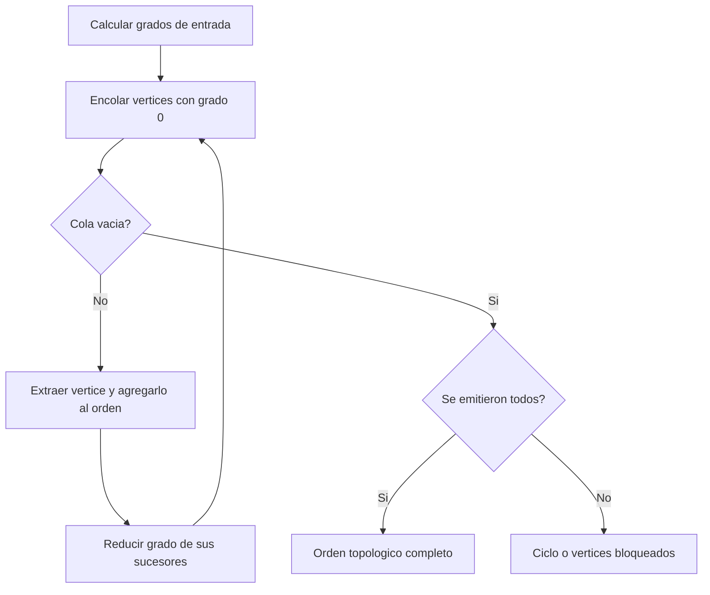

# Algoritmo de Kahn

## Descripción

El Algoritmo de Kahn construye un orden topológico para un grafo dirigido de dependencias. Selecciona progresivamente los vértices que ya no tienen dependencias pendientes y los coloca en una cola. Si logra emitir todos los vértices, devuelve un orden válido; si algunos permanecen bloqueados, informa que existe un ciclo o una dependencia no resoluble.

## Ficha rápida

| Tipo | Familia | Paradigma | Conceptos |
|---|---|---|---|
| Grafo dirigido | Ordenamiento topológico | Greedy incremental | Grafo, aristas dirigidas, cola FIFO, grado de entrada |

| Rendimiento | Mejor | Promedio | Peor |
|---|---:|---:|---:|
| Tiempo | `O(V + E)` | `O(V + E)` | `O(V + E)` |
| Espacio auxiliar | `O(V + E)` | `O(V + E)` | `O(V + E)` |

## Problema

Dado un grafo dirigido de dependencias, producir un orden en el que cada vértice aparezca después de todos sus predecesores. Si las dependencias forman un ciclo, no existe un orden topológico completo y se debe informar el bloqueo.

## Contexto

Kahn se utiliza para planificar tareas, compilaciones, cursos, migraciones, paquetes y módulos con dependencias. La visualización usa escenarios canónicos pequeños y deterministas, sin red, base de datos ni ejecución de código proporcionado por la persona usuaria.


## Entradas

| Entrada | Tipo | Restricciones |
|---|---|---|
| Vértices | Conjunto `V` | Identificadores únicos |
| Aristas | Conjunto `E` | Dirección `dependencia → dependiente` |
| Grafo | `G = (V, E)` | Finito y representable en memoria |
| Desempate | FIFO en esta interfaz | Si hay varias fuentes, el orden puede no ser único |

## Salidas

| Salida | Significado |
|---|---|
| `order` completo | Orden topológico válido cuando se emiten todos los vértices |
| `order` parcial | Vértices emitidos antes de que la cola quede vacía |
| Diagnóstico de ciclo | Se produce cuando `length(order) < |V|` |
| Grados restantes | Dependencias que continúan bloqueando vértices |

## Supuestos

### Explícitos

- El grafo es dirigido.
- El grado de entrada se calcula para todos los vértices.
- Los nodos aislados también forman parte de `V`.
- Una arista `u → v` significa que `u` debe aparecer antes que `v`.

### Implícitos

- Los identificadores de nodos son únicos.
- Cada extremo de una arista existe en `V`.
- La estructura de adyacencia es finita y cabe en memoria.
- La cola FIFO es un desempate válido; no implica que el orden sea único.


## Idea principal

> Mantener una cola de vértices con grado de entrada cero, emitirlos y liberar progresivamente a sus sucesores.

## Visualización

> Flujo visual: calcular grados, encolar fuentes, emitir vértices, liberar sucesores y determinar si queda un ciclo.



El diagrama resume el flujo general. El visualizador muestra los valores concretos de la cola, los grados y el orden en cada snapshot.

## Solución

1. Inicializar el grado de entrada y la lista de sucesores de cada vértice.
2. Recorrer las aristas y calcular cuántas dependencias pendientes tiene cada vértice.
3. Encolar todos los vértices cuyo grado de entrada sea cero.
4. Extraer un vértice de la cola y agregarlo al orden.
5. Decrementar el grado de entrada de sus sucesores.
6. Encolar cada sucesor que llegue a grado cero.
7. Repetir hasta que la cola quede vacía.
8. Comparar la cantidad emitida con la cantidad total de vértices.

### Pseudocódigo

```text
procedure Kahn(graph):
    for each vertex v in graph.vertices:
        indegree[v] = 0
        outgoing[v] = []

    for each directed edge (u, v) in graph.edges:
        indegree[v] = indegree[v] + 1
        append v to outgoing[u]

    queue = all vertices v where indegree[v] == 0
    order = []

    while queue is not empty:
        current = dequeue(queue)
        append current to order

        for each successor in outgoing[current]:
            indegree[successor] = indegree[successor] - 1
            if indegree[successor] == 0:
                enqueue(queue, successor)

    if length(order) != number of graph.vertices:
        return { status: "cycle", order: order }

    return { status: "complete", order: order }
```

## Correctitud

- Un vértice solo entra en la cola cuando todos sus predecesores ya fueron emitidos.
- Por lo tanto, cada vértice agregado a `order` aparece después de sus dependencias.
- En un DAG siempre existe al menos un vértice con grado de entrada cero.
- Eliminar ese vértice conserva un DAG más pequeño.
- Por inducción, todos los vértices de un DAG pueden emitirse.
- Si la cola queda vacía y aún existen vértices, las dependencias restantes forman o dependen de un ciclo.

## Complejidad detallada

Definimos:

```text
V = número de vértices
E = número de aristas
```

El tiempo es `O(V + E)`. Estas implementaciones reciben vértices y aristas y construyen grados, listas de adyacencia, cola y resultado; por ello su espacio auxiliar es `O(V + E)`. La tabla inicial resume las cotas por escenario.

Cada vértice se encola y emite como máximo una vez. Cada arista se procesa una vez al decrementar el grado del sucesor. La aplicación conserva snapshots de la traza para la visualización; esos snapshots pueden consumir más memoria que el algoritmo puro.

## Consecuencias

### Ventajas

- Complejidad lineal `O(V + E)`.
- Detecta ciclos durante el mismo proceso.
- Expone claramente las dependencias pendientes.
- Permite visualizar por qué un nodo queda bloqueado.

### Desventajas

- Requiere memoria para grados y adyacencias.
- No produce un orden completo si existen ciclos.
- FIFO no garantiza el orden lexicográficamente menor.
- Los snapshots de visualización no escalan a grafos grandes.

### Trade-offs

- FIFO simplifica la traza, pero no determina un único orden universal.
- Guardar snapshots facilita el aprendizaje, pero usa más memoria.
- Validar entradas mejora el diagnóstico, con un costo lineal adicional pequeño.

## Alternativas

| Alternativa | Complejidad | Cuándo usarla |
|---|---:|---|
| Orden topológico por DFS | `O(V + E)` | Cuando ya existe infraestructura de DFS y estados de visita |
| Kahn con min-heap | `O((V + E) log V)` | Cuando se necesita el orden lexicográficamente menor |
| Recalcular grados repetidamente | `O(V · E)` o peor | Solo como borrador; no recomendado para producción |

## Pruebas

### Pruebas unitarias generales

- Cada arista `u → v` debe respetar la posición de `u` antes que `v` en un DAG.
- El resultado debe contener cada vértice una sola vez cuando no hay ciclo.
- Ningún vértice emitido debe conservar un predecesor no emitido.
- Un ciclo debe producir resultado parcial y diagnóstico.
- Nodos aislados deben poder emitirse.
- Aristas paralelas deben decrementar el grado tantas veces como aparezcan.

El conjunto completo de escenarios, sus parámetros y las pruebas por lenguaje se encuentra en el tab **Pruebas**. El README conserva únicamente las reglas generales que deben cumplir las pruebas.

## Aplicaciones reales

- Orden de compilación de módulos y proyectos.
- Instalación y resolución de paquetes.
- Planificación de tareas y pipelines de datos.
- Orden de migraciones de base de datos.
- Programación de cursos con prerrequisitos.
- Ejecución de etapas de workflows.

## Errores comunes

| Error | Tratamiento en el visualizador |
|---|---|
| Invertir el sentido de las aristas | Se documenta como supuesto de entrada |
| Olvidar nodos aislados | Se cubre con casos de nodos aislados |
| No comparar emitidos con `V` | Se cubre con casos de ciclo y auto-arista |
| Suponer que existe un único orden | Se demuestra con varias fuentes y componentes desconectados |
| Ignorar aristas paralelas | Se cubre con un caso de aristas duplicadas |
| Referencias a nodos inexistentes | El escenario canónico `unknown-vertex` exige un diagnóstico de entrada inválida antes de ejecutar el algoritmo |

## Fuentes

- A. B. Kahn, “Topological sorting of large networks”, *Communications of the ACM*, 1962. [DOI](https://doi.org/10.1145/368996.369025)
- [NIST Dictionary of Algorithms and Data Structures](https://xlinux.nist.gov/dads/)
